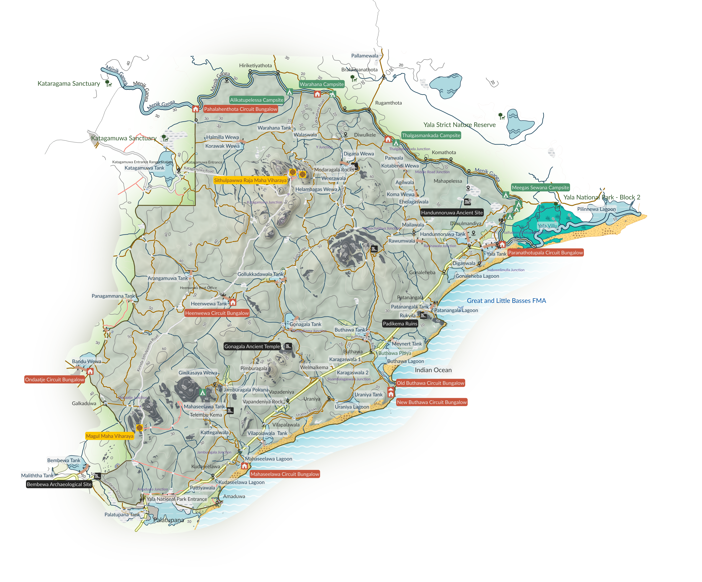
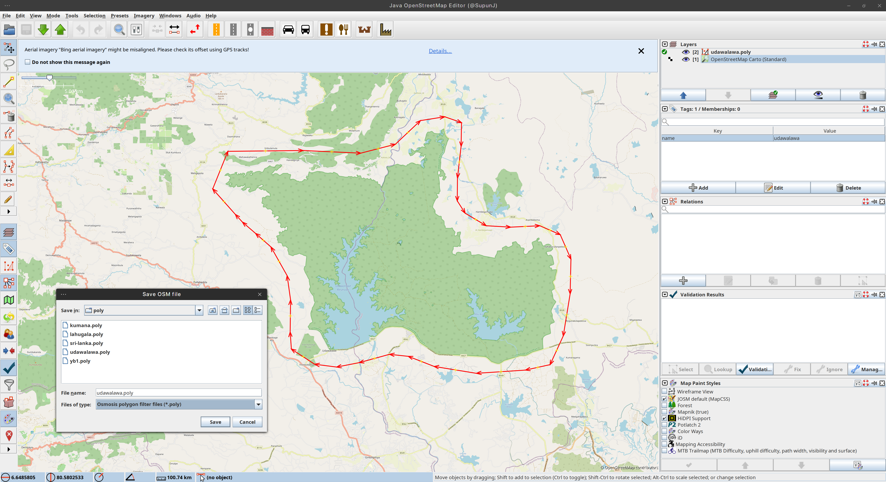
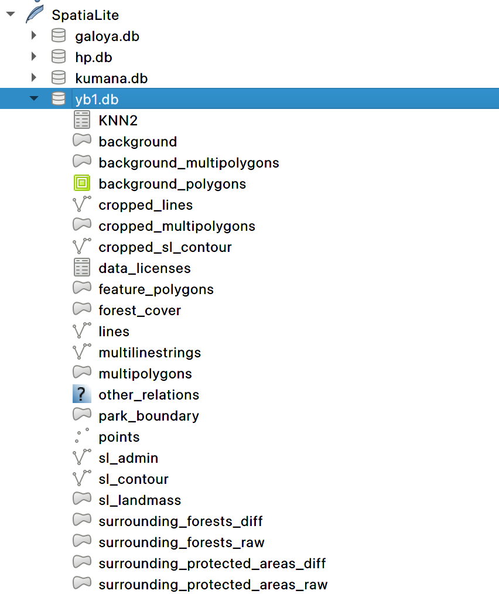
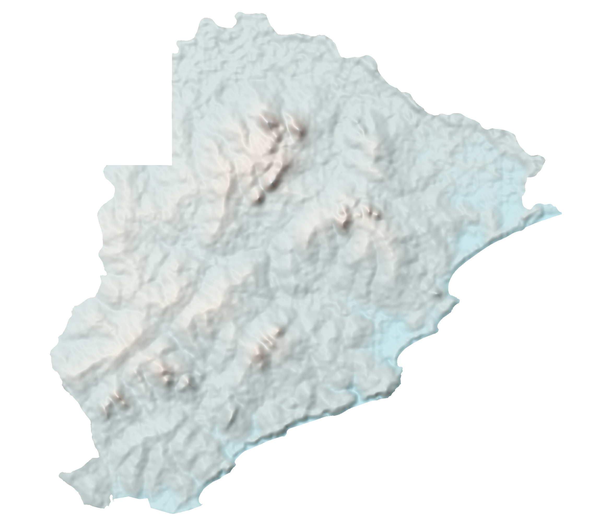
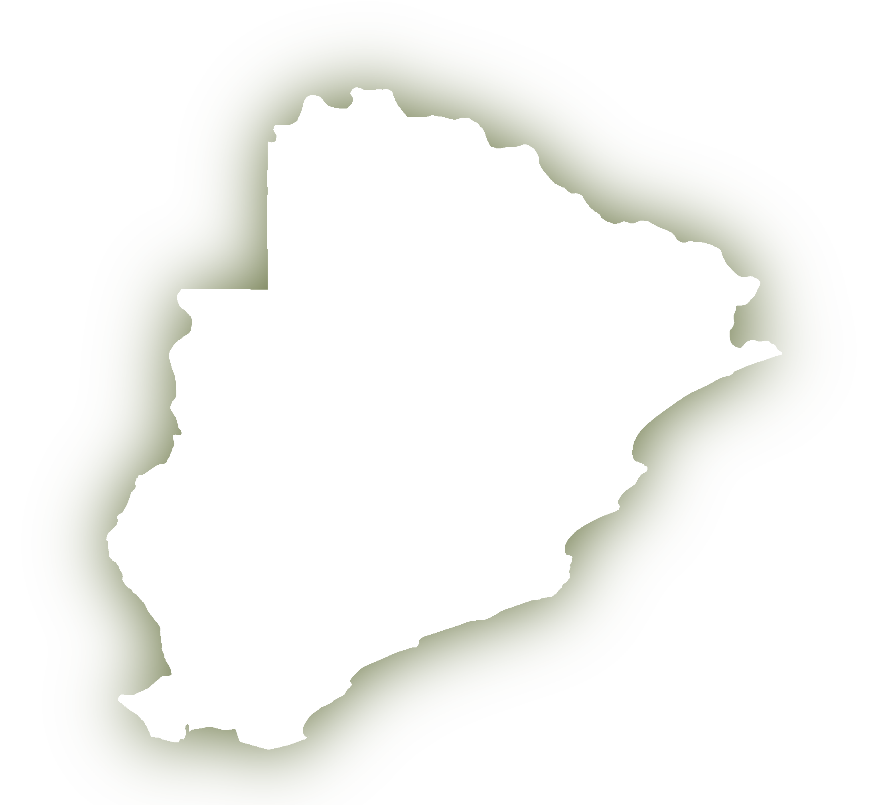
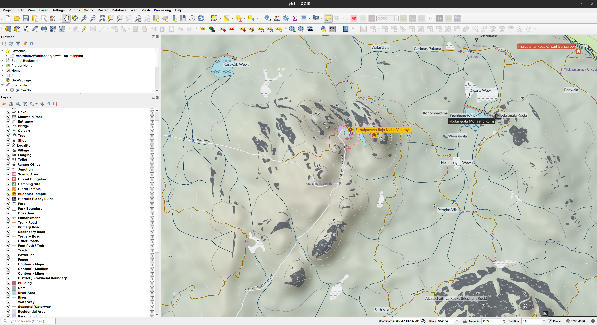
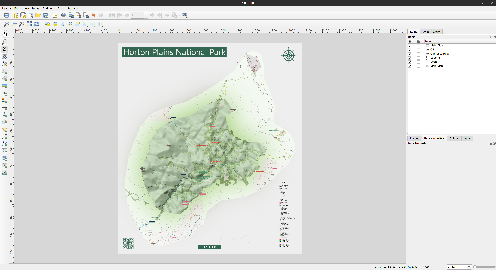

# Maps of Sri Lanka's National Parks 🇱🇰

- Lahugala-Kithulana National Part - [[4ftx2ft/PDF]](render/lahugala/lahugala-4x2.pdf) , [[8ftx5ft/PDF]](render/lahugala/lahugala-8x5-plain-optimised.pdf) , [[SVG]](render/lahugala/lahugala-8x5-plain-optimised.svg) , [[A4/Monochrome/PDF]](render/lahugala/lahugala-A4-monochrome-inkscape.pdf) 🐘🐆
- Horton Plains National Park - [[1:10000/PDF]](render/hp/Horton_Plains_National_Park_1_10000.pdf) , [[1:10000/PNG]](render/hp/Horton_Plains_National_Park_1_10000.png) 🐆


## Why?

This project exists due to few different reasons. Long term hobby of creating custom maps for my Garmin devices was probably the original motivation. Being a long time contributor to [OpenStreetMap](https://www.openstreetmap.org) was another. There was also a need to find an excuse to learn a bit about GIS. Finally, receiving a request to create a map for a small National Park in the Eastern Province ticked off the check-list. That map was created using OSM data and the styling was done in [Inkscape](https://inkscape.org), but eventually ended up scripting about 70% of the process of generating a printable map from acquisition, cleansing and enrichment of data to the generation of the [QGIS](https://qgis.org) project with vector and raster layers.



Whatever is here can be used without any restrictions but attributions will be appreciated :pray:

## Limitations

1. Only supports OSM data in v6 XML format or in PBF format
2. Park boundary should be a closed way tagged as ['boundary=national_park'](https://wiki.openstreetmap.org/wiki/Tag:boundary%3Dnational_park) - This can be changed but will require some refactoring time.
3. The boundary should contain a unique name
4. Elevation data are in USGS SRTM format

## Pre-requisites

1. A Linux box. The commands here are for Debian but any other distribution would do as long as you can get the dependencies running
2. [yq](https://github.com/mikefarah/yq) - `sudo apt install yq`
3. [poly2geojson](https://github.com/pirxpilot/poly2geojson)
    - `sudo apt install cargo`
    - `cargo install poly2geojson`
4. [osmosis](https://github.com/openstreetmap/osmosis/releases/latest) - `sudo apt install openjdk-21-jdk`
5. [GDAL](https://gdal.org/en/stable) - `sudo apt install gdal-bin`
6. [osmium](https://osmcode.org/osmium-tool) - `sudo apt install osmium-tool`
7. [SpatiaLite](https://www.gaia-gis.it/fossil/libspatialite/index) - `sudo apt install spatialite-bin`
8. [ImageMagick](https://imagemagick.org/script/index.php) - `sudo apt install imagemagick`
9. [rsvg-convert](https://github.com/bvibber/librsvg) - `sudo apt install librsvg2-bin`
10. [xmlstarlet](https://xmlstar.sourceforge.net) - `sudo apt install xmlstarlet`
11. [svgo](https://github.com/svg/svgo) - `npm install -g svgo`
    - *nvm - `curl -o- https://raw.githubusercontent.com/nvm-sh/nvm/v0.40.1/install.sh | bash`*
    - *node.js - `nvm install v22.12.0`*
12. [QGIS](https://www.qgis.org) - `sudo apt install qgis`
13. Python 3 and imported modules
    - `sudo apt install python3-ruamel.yaml`
    - `sudo apt install python3-geopy`

### Optional

1. [Inkscape](https://inkscape.org) - `sudo apt install inkscape`
2. [JOSM](https://josm.openstreetmap.de) with 'poly' plugin for creating [OSM Polygon Filters](https://wiki.openstreetmap.org/wiki/Osmosis/Polygon_Filter_File_Format) - `sudo apt install josm`
3. [qrencode](https://fukuchi.org/works/qrencode) - `sudo apt install qrencode`
4. [VSCodium](https://vscodium.com) or any other IDE
5. 'Monaco' or 'Lato' fonts

## Process

```mermaid
    %%{init: {'theme':'forest'}}%%
        flowchart TD
            start@{ shape: circle, label: "Start" }
            create_conf@{ shape: trap-t, label: "Create conf" }
            conf_yaml@{ shape: doc, label: ".yaml" }
            osm_mapping@{ shape: trap-t, label: "Add/Modify park in OSM" }
            park_poly_create@{ shape: trap-t, label: "Draw park polygon" }
            park_poly@{ shape: doc, label: ".poly" }
            osm_db@{ shape: cyl, label: "OSM" }
            osm_download@{ shape: rect, label: "Download \n OSM Data" }
            osm_data@{ shape: doc, label: ".pbf/.osm" }
            extract_park_data@{ shape: rect, label: "Extract park Data" }
            filtered_osm_data@{ shape: docs, label: "Filtered data (.osm)" }
            elevation_data@{ shape: docs, label: "Elevation data \n (.hgt/.tiff)" }
            gen_contour_lines@{ shape: rect, label: "Generate contour \n lines" }
            update_db@{ shape: rect, label: "Consolidate data and \n Update DB" }
            spatialite@{ shape: cyl, label: "SpatiaLite" }
            refine_data@{ shape: rect, label: "Refine data" }
            define_cmap_for_hill_shade@{ shape: trap-t, label: "Define colour map \n for shaded relief" }
            cmap_for_hill_shade@{ shape: doc, label: "Colour map (-cmap.txt)" }
            generate_shaded_relief@{ shape: rect, label: "Generate shaded relief" }
            hill_shade_raster@{ shape: doc, label: "Hill-shade (.tiff)" }
            generate_park_outer_glow@{ shape: rect, label: "Generate park's outer glow" }
            outer_glow_raster@{ shape: doc, label: "Outer glow (.tiff)" }
            define_qgis_layers@{ shape: trap-t, label: "Define QGIS layers" }
            qgis_layer_definitions@{ shape: doc, label: "Layers (.csv)" }
            create_map_symbols@{ shape: trap-t, label: "Create SVG \n map symbols" }
            map_symbols@{ shape: docs, label: ".svg" }
            generate_qgis_project@{ shape: rect, label: "Generate QGIS project" }
            qgis_project@{ shape: doc, label: "(.qgz)" }
            refine_qgis_project@{ shape: trap-t, label: "Refine the map" }
            generate_qgis_layout@{ shape: rect, label: "Generate QGIS layout" }
            refine_qgis_layout@{ shape: trap-t, label: "Refine the layout" }
            export_layout@{ shape: rect, label: "Export the layout" }
            final_map@{ shape: doc, label: "Final map (.pdf/.png)" }
            stop@{ shape: dbl-circ, label: "Stop" }
            
            start --> create_conf
            create_conf --> conf_yaml
            create_conf --> park_poly_create
            park_poly_create --> park_poly
            park_poly_create --> osm_mapping            
            osm_mapping --> osm_db
            osm_mapping --> osm_download
            osm_download --> osm_data
            osm_download --> dependencies{Dependencies fulfilled?}
            dependencies --> |Yes| extract_park_data
            dependencies --> |No| start
            extract_park_data --> filtered_osm_data
            extract_park_data --> gen_contour_lines
            gen_contour_lines --> update_db
            elevation_data --> gen_contour_lines
            update_db --> spatialite
            update_db --> refine_data
            spatialite --> refine_data
            refine_data --> spatialite
            refine_data --> define_cmap_for_hill_shade
            define_cmap_for_hill_shade --> cmap_for_hill_shade
            define_cmap_for_hill_shade --> generate_shaded_relief
            elevation_data --> generate_shaded_relief
            generate_shaded_relief --> hill_shade_raster
            generate_shaded_relief --> generate_park_outer_glow
            generate_park_outer_glow --> outer_glow_raster
            generate_park_outer_glow --> define_qgis_layers
            define_qgis_layers --> qgis_layer_definitions            
            define_qgis_layers --> create_map_symbols
            create_map_symbols --> map_symbols
            create_map_symbols --> generate_qgis_project
            generate_qgis_project --> qgis_project
            generate_qgis_project --> refine_qgis_project
            refine_qgis_project --> generate_qgis_layout
            generate_qgis_layout --> refine_qgis_layout
            refine_qgis_layout --> export_layout
            export_layout --> final_map
            final_map --> stop
   ```

## Steps

1. Clone the repo

2. Give shell scripts the execution permission
   ```
   $ chmod +x ./script/*.sh
   ```
3. Create the config - `cp ./conf/sl-np-mapping-template.yaml ./conf/sl-np-mapping.yaml`
   You can use `{$HOME}` and `{$base_dir}` can be used and variables in the config and they will be replaced by the environment variables `$HOME` and `$base_dir` respectively. The configurable items are self descriptive

4. Create the park polygon in JOSM and save it as a .poly file. The name of the file is quite important as you need to pass that to subsequent scripts

   

   Make sure to change the second line, which is the polygon name to the park name. Typically the original value there would be `1`

5. `./script/init-data.sh <park_name> $(pwd)` - Acquire and filter OSM data for the given parkThis produces following output files
    - `$base_dir/var/$np-background.osm`
    - `$base_dir/var/$np-boundary-polygon.geojson`
    - `$base_dir/var/$np-boundary-polygon.osm`
    - `$base_dir/var/$np-cleansed.osm`
    - `$base_dir/var/$np.geojson`
    - `$base_dir/var/$np-srtm.tiff`
    - `$base_dir/var/$np-surrounding-forests.osm`
    - `$base_dir/var/$np-surrounding-protected-areas.osm`
    - `$base_dir/var/sl-admin.osm`
    - `$base_dir/var/sl-coastline.osm`
    - `$base_dir/var/sl-contour.dbf`
    - `$base_dir/var/sl-contour.prj`
    - `$base_dir/var/sl-contour.shp`
    - `$base_dir/var/sl-contour.shx`
    - `$base_dir/var/sri-lanka.geojson`
    - `$base_dir/var/sri-lanka-latest.osm.pbf`

6. `./script/init-db.sh <park_name> $(pwd)` - Insert all the data collected to a SpatiaLite DB. SpatiaLite makes it possible to store the data without having to host a database server and also provides decent support for spatial data handling. This produces the file `$base_dir/db/$np.db`. During this process the vector data will be cleansed, massaged and enriched even more. The SQL script for the latter is in the file `$base_dir/script/enrich-and-add-geometry.sql`. This script will produce following tables in the DB

    

7. Define the [colour map](https://gdal.org/en/stable/programs/gdaldem.html) for the shaded relief for the park and place it in `$base_dir\dem`. The park name should be prefixed

8. `./script/init-shaded-relief.sh <park_name> $(pwd)` - This generates the hill-shade background raster and the park boundary glow in GeoTIFF format. The latter is for eye-candy and can be turned off in the QGIS project. The output files are,
    - `$base_dir/var/$np-hill-shade.tiff`
    - `$base_dir/var/$np-boundary-glow.tiff`

    
    

9. Define QGIS layers along with desired symbology. This is done in the file `$base_dir/qgis/layer/$np-qgis-layers.csv`. Below is the format of the CSV. The master template for this can be found in the file [$base/qgis/layer/master-qgis-layers.csv](./qgis/layer/master-qgis-layers.csv)

10. Create SVG symbols for POIs in the folder `$base_dir/symbol`. These will be converted to QGIS friendly SVG format in the next step and be placed in the folder `$base_dir/qgis/symbol/$np` for each park. If you use 3rd party SVGs, please make sure to make appropriate attributions. The file name should be as same as the respective QGIS layer ID in the CSV file. You can have park specific symbols by prefixing the file name with the park name

11. `./script/init-qgis-project.sh <park_name> $(pwd)` - This will put everything together and generate a QGIS project that you can start working on

    

12. `./script/init-park.sh <park_name> $(pwd)` - This will run all the above scripts all at once.

13. `./script/init-qgis-layout.sh <park_name> <scale> $(pwd)` - This creates a layout for the given park in the given scale. The scale should be specified as a number (E.g.: If the desires scale is 1:10000, scale would be 10000)

    

14. `/script/render-park-v2.sh <park_name> <scale> <output format> $(pwd)` - This script exports a given layout in the given format. Possible values for the format are 'pdf' or 'png'. The output will be placed in the directory `$base_dir/render/<park name>`

    🚨Caution :  This operation will require a significant amount of memory and processing power depending on the scale of the map.